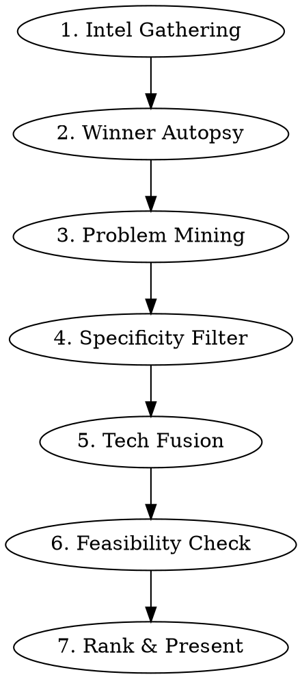

# Problem Statement Generator

## Overview

Generate hyper-specific, non-generic, real-world-problem-based solution ideas for hackathons, innovation challenges, and startup ideation. The core principle: **specificity wins — "catch fake Augmentin in Bhagirath Palace" beats "AI for healthcare" every time.**

## When to Use

- User is preparing for a hackathon / innovation challenge / ideation round
- User needs project ideas grounded in real problems
- User says existing ideas feel "too generic"
- User wants problem statements mapped to specific tech themes
- User wants startup ideas based on real pain points

**When NOT to use:** Pure technical implementation tasks, debugging, code review.

## The 7-Step Generation Engine



### Step 1: Intel Gathering

**Mandatory research before generating ANY ideas:**

| Source | What to Extract | Tool |
|--------|----------------|------|
| Hackathon website | Themes, judging criteria, submission format, eligibility, prizes | WebFetch |
| Past winners page | Winning projects, tech used, what judges praised | WebFetch |
| Problem aggregators (Razorpay Fix My Itch, YC RFS, etc.) | Real pain points from real people | WebFetch/WebSearch |
| News from last 6 months | Recent incidents, government reports, CAG audits, RBI bulletins | WebSearch |
| Domain-specific searches | Niche stats: "India [sector] fraud 2025", "[country] [problem] deaths statistics" | WebSearch |

**Do at least 5 web searches** targeting different angles of the problem space. Cast a wide net.

### Step 2: Winner Autopsy

Analyze past winners to extract the **winning formula:**

| Pattern to Identify | Example |
|---------------------|---------|
| Tech combinations that won | Quantum + AI + Healthcare |
| Problem specificity level | "98%+ accuracy on 1.5T MRI scans" not "better healthcare" |
| Impact framing | How did they quantify impact? |
| What the judges praised | Feasibility? Novelty? Social impact? |
| What themes won most | Healthcare won 2/3 in Year 16 |

**Output a "Winner DNA" summary** before generating ideas.

### Step 3: Problem Mining

Search for problems that are:

| Criteria | Good Signal | Bad Signal |
|----------|-------------|------------|
| **Specific** | "400/1183 medicine samples in Bhagirath Palace were fake" | "Healthcare needs improvement" |
| **Quantified** | "Rs 10.7 lakh crore in delayed MSME payments" | "MSMEs struggle" |
| **Underserved** | Nobody is currently solving this at scale | 50 startups already exist here |
| **Locale-specific** | Unique to India/target country/region | Could be anywhere generic |
| **Emotionally resonant** | "300 sanitation workers die in sewers yearly" | "Efficiency could improve" |
| **Recent** | CAG flagged this in 2025, RBI data from last quarter | Decade-old well-known issue |

**Search queries that find gold:**
- `"[country] [sector] fraud [recent year]"`
- `"[country] deaths due to [specific cause] statistics"`
- `"[country] crore lost [sector] [year]"`
- `"CAG audit findings [scheme name]"`
- `"[country] specific problems nobody solving [sector]"`
- `"[country] niche underserved [sector] gap"`

### Step 4: Specificity Filter

**Kill every generic idea. Apply the "Chandni Chowk Test":**

> If your problem statement doesn't mention a specific place, specific number, or specific incident — it's too generic. Rewrite it.

| FAIL (Generic) | PASS (Specific) |
|----------------|-----------------|
| "AI for healthcare" | "AI to detect counterfeit medicines in Bhagirath Palace where 400/1183 samples were fake" |
| "IoT for smart cities" | "IoT gas badges for 5M sanitation workers — 300 die yearly from H2S in sewers" |
| "Quantum for security" | "Post-quantum shield for DigiLocker's 600Cr documents against harvest-now-decrypt-later attacks" |
| "AR for education" | "AR overlays guiding 2000 patients through AIIMS Delhi's labyrinthine OPD corridors" |
| "Agents for automation" | "5-agent swarm that auto-files SAMADHAAN complaints for MSMEs owed Rs 10.7L Cr" |

### Step 5: Tech Fusion

Map each specific problem to hackathon themes using **non-obvious combinations:**

**Rules:**
1. **Combine 2+ technologies** from the theme (not just one)
2. **The tech must have a genuine advantage** for this problem (not forced)
3. **At least one "unexpected" pairing** (AR + agriculture, Quantum + kirana delivery)
4. **Name specific frameworks/tools** (Qiskit, LangGraph, ARCore, ESP32) — shows depth

**Tech fusion patterns that impress judges:**
- Edge AI + IoT mesh + social impact = "Connected World" gold
- Multi-agent architecture + government process = "Agents Unleashed" gold
- Post-quantum crypto + Indian DPI (UPI/Aadhaar/DigiLocker) = "Beyond the Perimeter" gold
- AR/VR + blue-collar/underserved population = "Immersive Experiences" gold
- Quantum algorithm + supply chain/molecular/optimization = "Quantum Frontier" gold

### Step 6: Feasibility Check

**Every idea must pass the "4-Person Weekend Test":**

| Check | Threshold |
|-------|-----------|
| Can 4 people split the work cleanly? | Each person owns a distinct module |
| Can a prototype exist in 2-4 weeks? | Core functionality, not polish |
| Hardware cost (if IoT) | < Rs 5,000 total for demo |
| Data availability | Public datasets or self-collectible |
| Demo-ability | Can you show it live in 5 minutes? |
| No dependency on enterprise APIs | No "requires AWS contract" blockers |

### Step 7: Rank & Present

**Present ideas in this format for each idea:**

```
### IDEA [N] — Theme: "[Theme Name]"
#### [Catchy Title]

**The Specific Problem:**
[2-3 lines with HARD NUMBERS and specific locations/incidents]

**Solution — "[Product Name]":**
[Architecture table or bullet points — what each component does]

**Tech Stack:** [Specific frameworks, not vague categories]

**Why it's NOT generic:**
[3-4 bullets explaining uniqueness]

**Team split:** [How 4 people divide the work]
```

**After all ideas, provide:**
1. Comparison table (uniqueness, feasibility, demo-ability, judge resonance)
2. Clear #1 recommendation with reasoning
3. Offer to draft the abstract

## Idea Multiplier Patterns

When you need MORE ideas from the same research, apply these lenses:

| Lens | How to Apply |
|------|-------------|
| **Fraud Angle** | Every government scheme has fraud. Find the fraud. Build the detector. |
| **Invisible Worker** | ASHA workers, anganwadi workers, sanitation workers, waste pickers — whose paperwork can you automate? |
| **Last Mile** | What works in metros but fails in Tier-3? Cold chain, delivery, diagnostics, legal access. |
| **Cross-Scheme** | Connect two unrelated government databases to find anomalies nobody's looking for. |
| **Reverse Flow** | India exports tech (UPI). What if you secure/improve the export? |
| **The Middleman** | Wherever there's a corrupt/inefficient middleman, there's an AI agent opportunity. |
| **Time-Bomb** | What's fine today but catastrophic in 5 years? (Quantum breaking encryption, climate migration, antibiotic resistance) |

## Common Mistakes

| Mistake | Fix |
|---------|-----|
| Starting with technology, not problem | Always start with "who is suffering and why?" |
| Using the theme name as the idea | "IoT for connected world" is not an idea |
| No numbers in the problem statement | Find the statistic. Every problem has one. |
| Solution doesn't need the stated tech | If classical ML works, don't force quantum. Match genuinely. |
| Can't be demoed | If you can't show it in 5 min, pick a different idea. |
| Ignoring the judges' employer | Unisys = security company. Razorpay = payments. Tailor accordingly. |

## Abstract Writing Guide

When user asks to draft the abstract:

```
Structure (strict order):
1. Problem (2-3 lines, lead with the shocking statistic)
2. Why existing solutions fail (2 lines)
3. Your solution (5-6 lines, architecture-level)
4. Key innovation / what's novel (2 lines)
5. Tech stack (1 line, specific names)
6. Impact (2 lines, quantified)
7. Scalability (1 line — "extends to...")
```

**Rules:**
- Lead with the HUMAN problem, not the tech
- Include exactly ONE hard metric ("saves 23 min in emergency response")
- Name-drop relevant standards/bodies (NIST, WHO, NDMA, RBI, CAG)
- End with scalability — judges love "this can be extended to..."
- Keep under 300 words unless format specifies otherwise
