# Flowcharts

All diagrams are in Mermaid format. Render with any Mermaid-compatible viewer.

---

## 1. Daily Habit Completion Flow

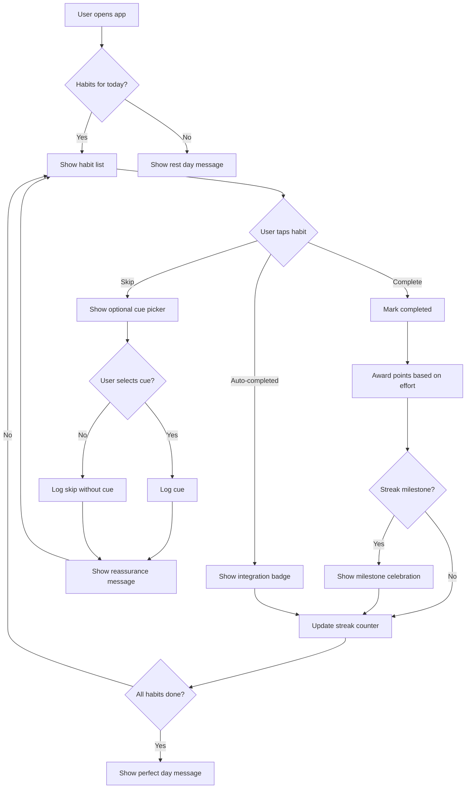

---

## 2. Streak Freeze Flow

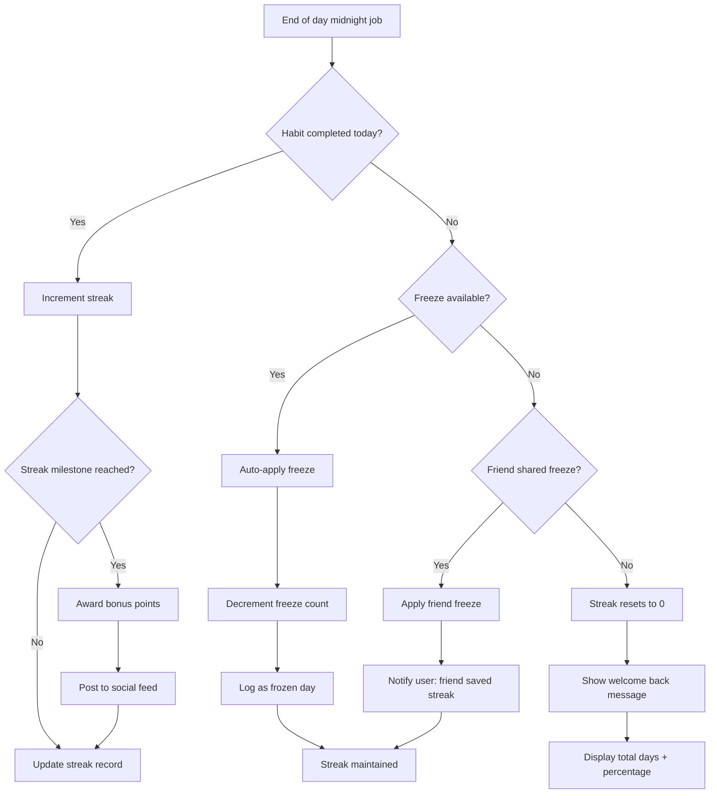

---

## 3. Group Streak Evaluation

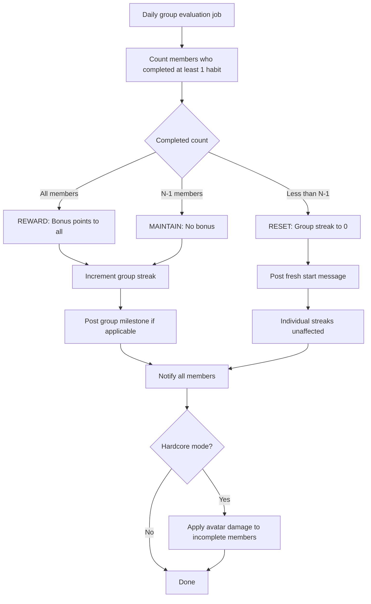

---

## 4. Sub-Habit Generation Flow

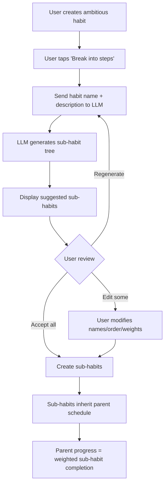

---

## 5. Integration Auto-Tracking Flow

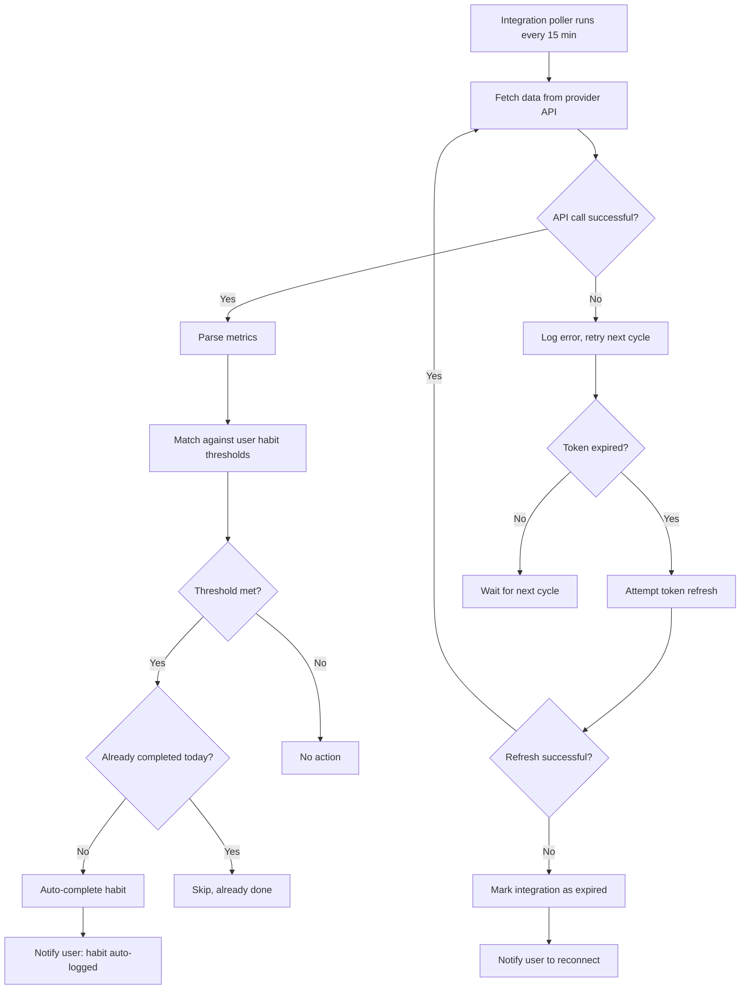

---

## 6. Nudge Flow

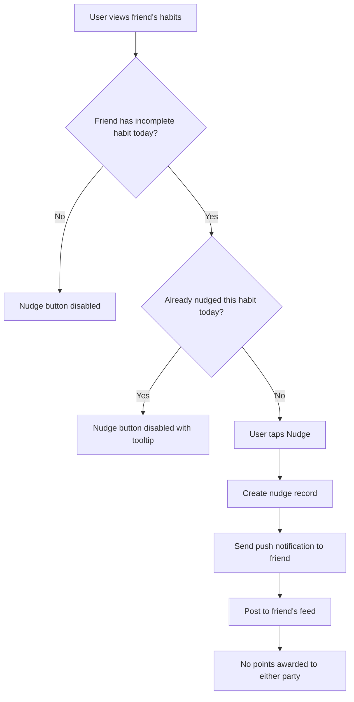

---

## 7. Tier Promotion/Demotion Flow

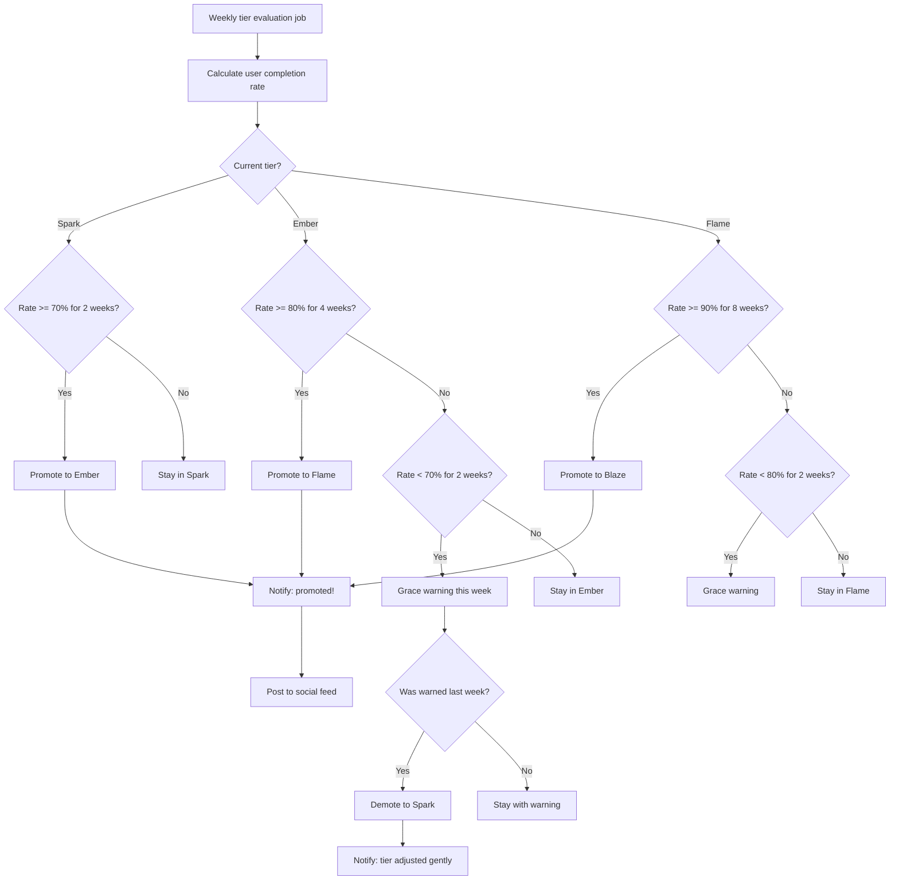

---

## 8. End-of-Day Notification Flow

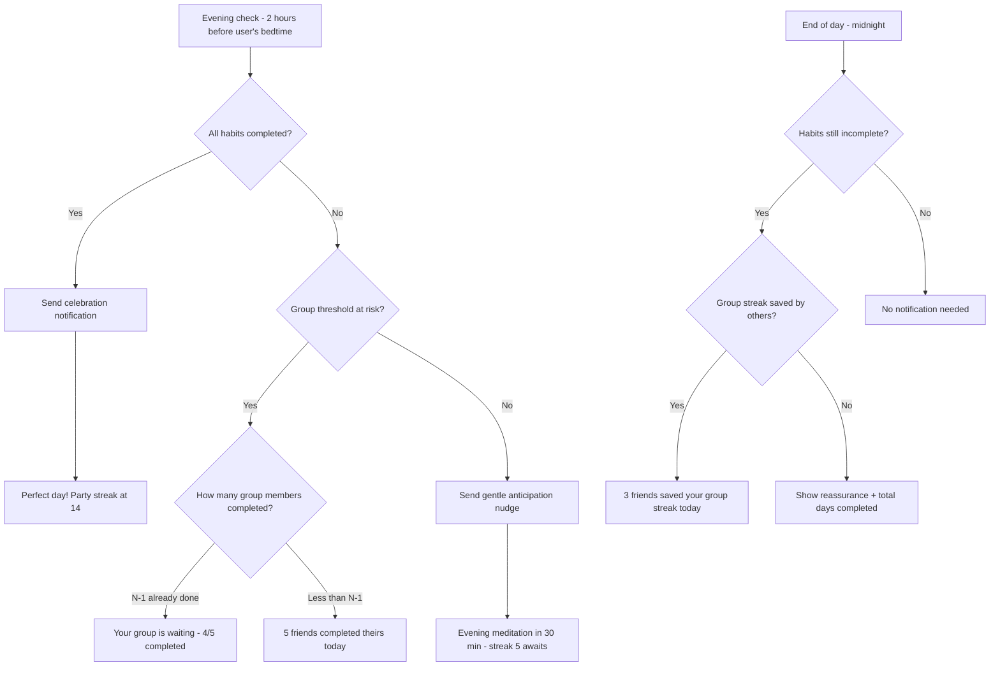

---

## 9. Onboarding Flow

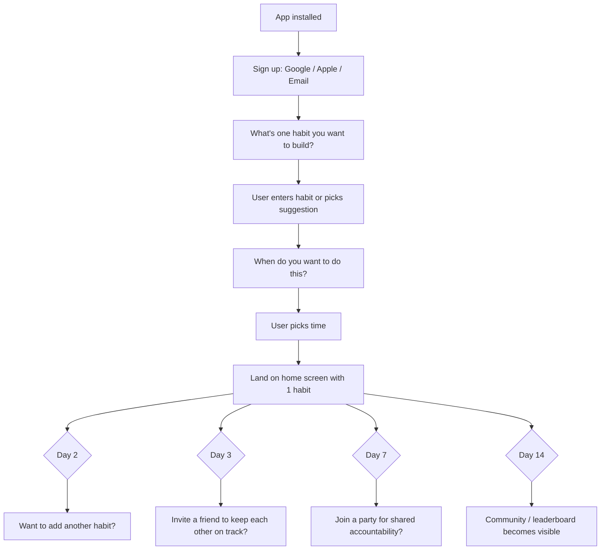

---

## 10. Negative Habit Tracking Flow

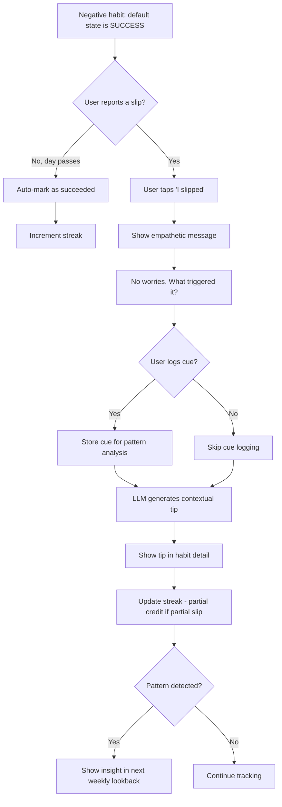

---

## 11. Reward Pool Flow

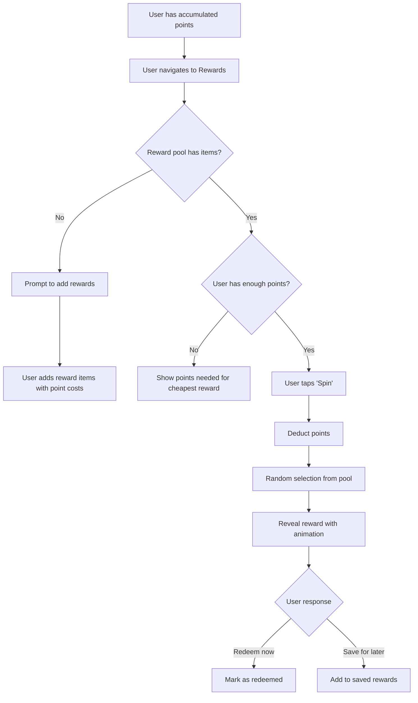
